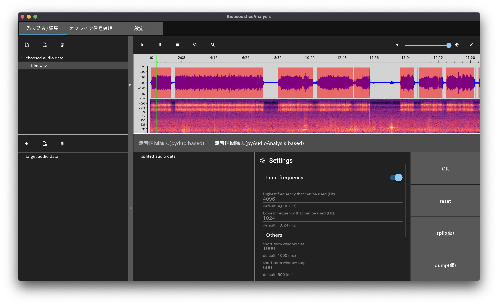

# Bioacoustics Analysis Tools

## 概要
- Python のみでコーディングされた生物音響解析ツール．
    - GUIライブラリ：kivy，kivyMD
    - 行列計算ライブラリ：pytorch，numpy
    - グラフ描画ライブラリ：matplotlib

- 区間抽出，雑音除去などの前処理から，解析処理までの一連の作業をできるだけ簡単に行えるような形で実装することが目標．
    - 前処理：無音区間の除去による区間抽出 ~~，雑音除去~~
    - 音声信号処理： ~~音源分離，音源定位~~
    - 生物ごとの解析処理： ~~カエルのコーラス解析~~

- メインで開発を進めるのは，カエルのコーラス解析の処理．将来的には様々な生物に対応したい．

## ToDo
- カエルコーラス解析までの実装
- 波形・スペクトログラムのプロットが遅い
    - matplotlib 以外のグラフ描画ライブラリの使用を検討

## アプリケーション実行例
画面は開発中のものです．

