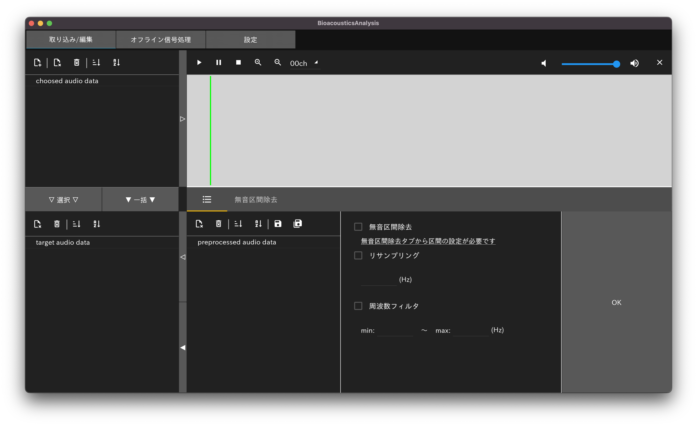
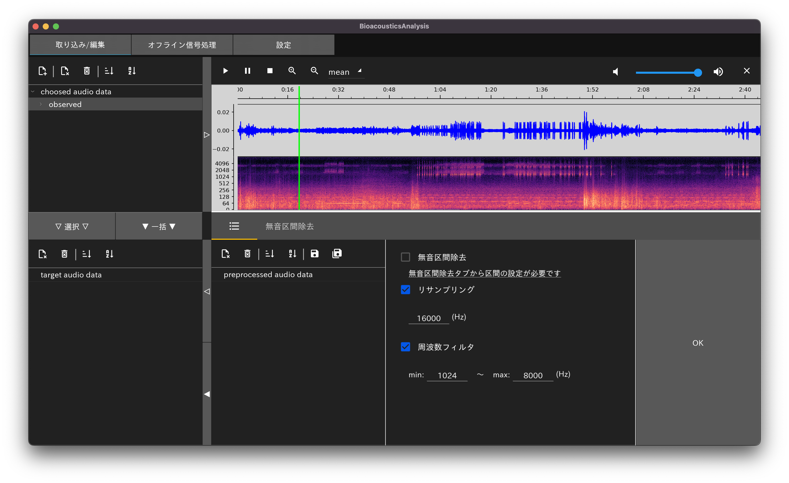
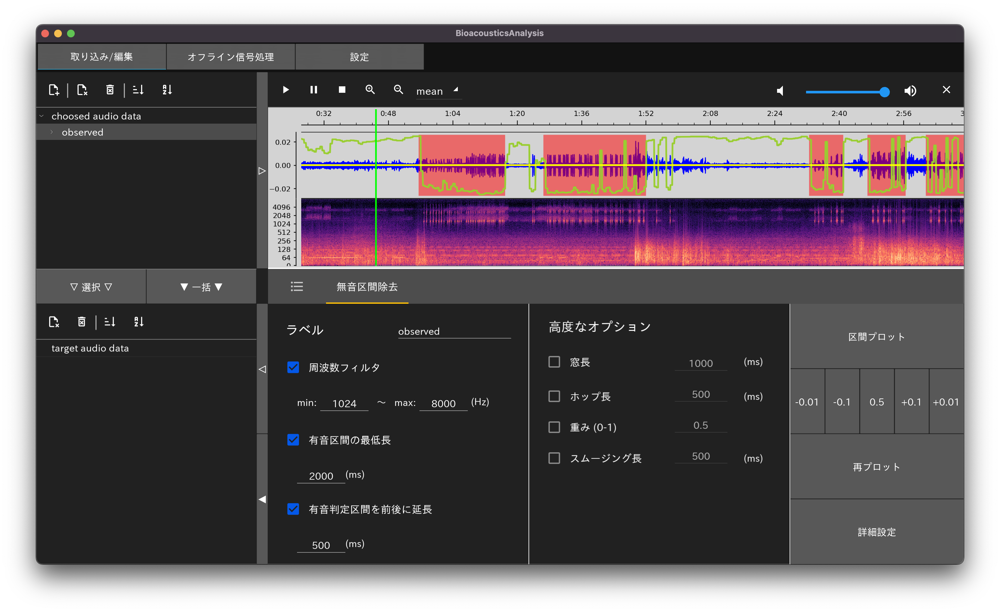
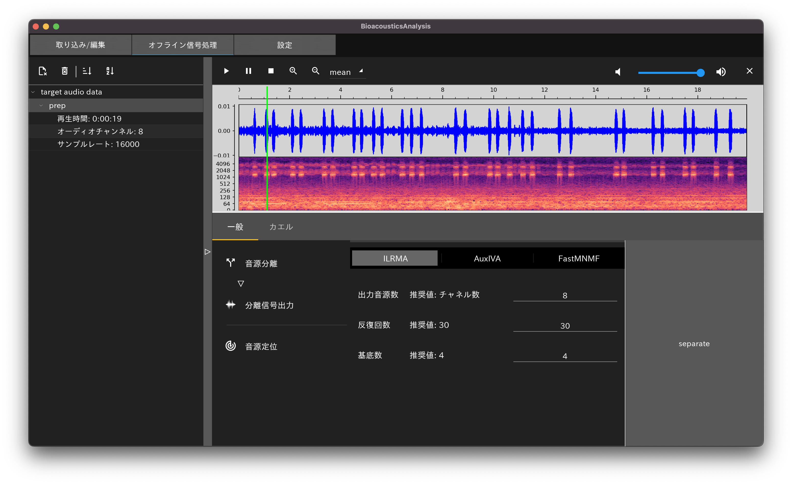
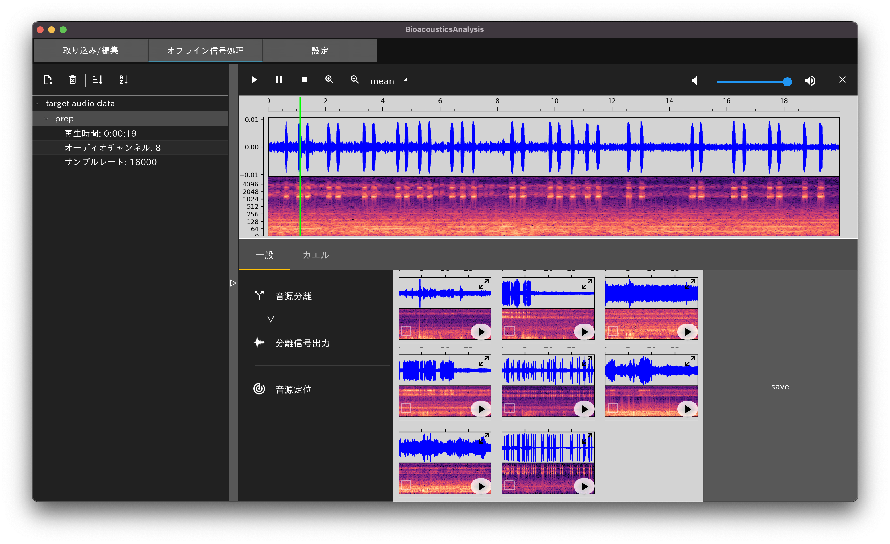
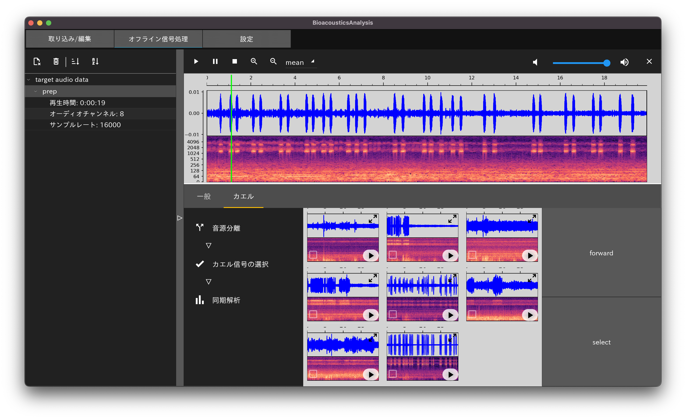
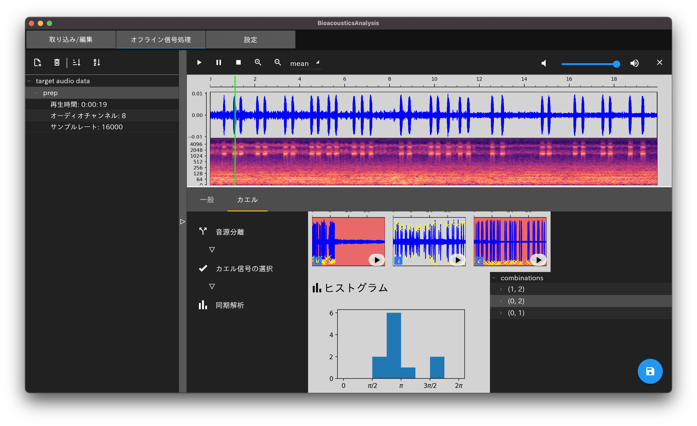

# Bioacoustics Analysis Tools

## 概要
- Python でコーディングされた生物音響解析ツール
  - GUIライブラリ：kivy，kivyMD
  - 行列計算ライブラリ：pytorch，numpy
  - グラフ描画ライブラリ：matplotlib

- 前処理から解析処理までの一連の信号処理作業をできるだけ簡単に行えるGUIアプリケーションを提供
  - 前処理
    - 無音区間の除去に基づく区間抽出
    - 周波数フィルタに基づく雑音除去
    - リサンプリング
  - 生物ごとの解析処理
    - 生物一般
      - 多チャネルブラインド音源分離
      - ~~音源定位~~
    - アマガエル
      1. 野外のアマガエルの多チャネル観測信号をブラインド音源分離
      2. 分離信号からアマガエルの信号を選択
      3. 修正版レイリー検定を用いた統計量とヒストグラムをプロット

- メインで開発を進めるのは，アマガエルのコーラス解析の処理．

## 現在のバージョン
0.0.1-beta.2

## ToDo
- 音源定位
- オプション拡充
- 各種例外処理

## 操作方法
### メイン画面

- 上のタブからモードを切り替え
  - 取り込み/編集
  - オフライン信号処理
  - 設定

### 取り込み/編集

- 左上のアイコンからファイルを追加
  - 追加ファイルは順にスタックされる
  - 左上のアイコンから読み込みファイルの削除やソート(ラベル順，信号長順)が行える
  - 各ファイルの再生時間，チャネル数，サンプルレートについて確認できる
- 前処理を行う場合
  - 読み込みファイルの中から対象となるファイルを選択し，▷ボタンを押した後で前処理へ
  ---
  - 無音区間除去
    
    - 無音区間判定の際に周波数フィルタを適用したり，有音区間の最低長や判定区間の延長などが行える
    - パラメータを変える場合は，値の書き換えに加えて☑で選択する必要がある
    - 区間プロットボタンを押した後にプロットされる赤い区間が有音判定区間になる
  - リサンプリング
    - 標準的なダウンサンプリング(またはアップサンプリング)
  - 周波数フィルタ
    - 標準的なローパスまたはハイパスフィルタ
  ---
  - 適用する前処理を☑で選択し，OKボタンで前処理を行う
  - 無音区間除去による区間選択をする場合は，リサンプリングや周波数フィルタが対象の全区間に対して適用される．また，ラベル名は自動的に"{ラベル名}\_{区間開始(ms)}\_{区間終了(ms)}"となる．
  - 無音区間除去による区間選択をしない場合，元のファイルと区別するためにラベルの最後に"\_preprocessed"が自動的に付与される
  - 💾アイコンから前処理信号の書き出しが可能．選択ファイルの書き出し(ファイル名指定可)と全ファイルの一括書き出し(ファイル名指定不可)の2つから選択できる．
- 前処理を行わない場合
  - ▽(選択したファイルのみ)または▼(読み込んだファイル全て)ボタンを押した後でオフライン信号処理へ

### オフライン信号処理
- 一般
  - 一般の生物音声に対しての適用
  ---
  - 音源分離
    - ▷ボタンでファイルを選択
    
    - 多チャネル音源分離手法(ILRMA，AuxIVA，FastMNMF)が選択できる
    
    - 分離信号の中から☑したものをまとめて1つの音声ファイルとして書き出しできる
    - 拡大表示と音声の再生も可能
  - 音源定位
    - 未実装
  ---
- カエル
  - 主にアマガエルに対しての適用
  ---
  - 音源分離
    - 一般タブの音源分離と同じなため省略
  - 分離信号選択
    
    - forwardボタンで一般タブに転送(一般タブで保存が可能)
    - カエルの信号を☑で選択し，選択された信号を次の解析処理に使用
  - 同期解析
    
    - 選択された信号の全組み合わせで同期を評価
    - 右下で選択された組み合わせの解析結果がヒストグラムと統計量で表示される
    - 💾アイコンで発声タイミングとそれぞれの組み合わせにおける統計量をcsvで保存できる
  ---