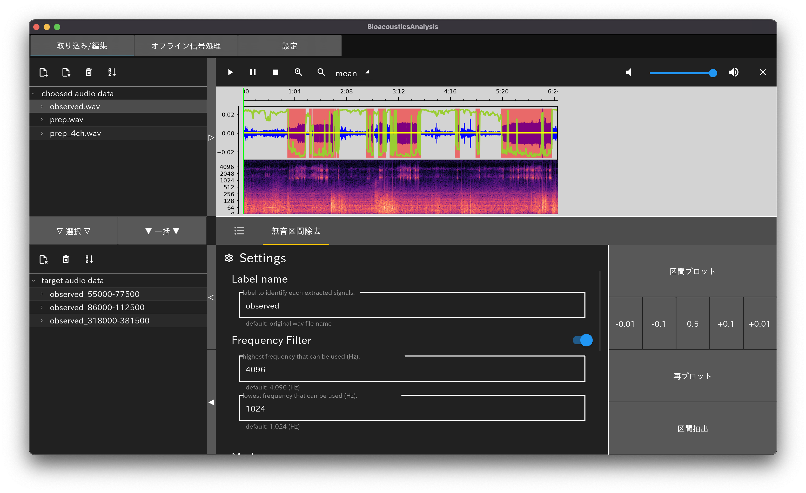
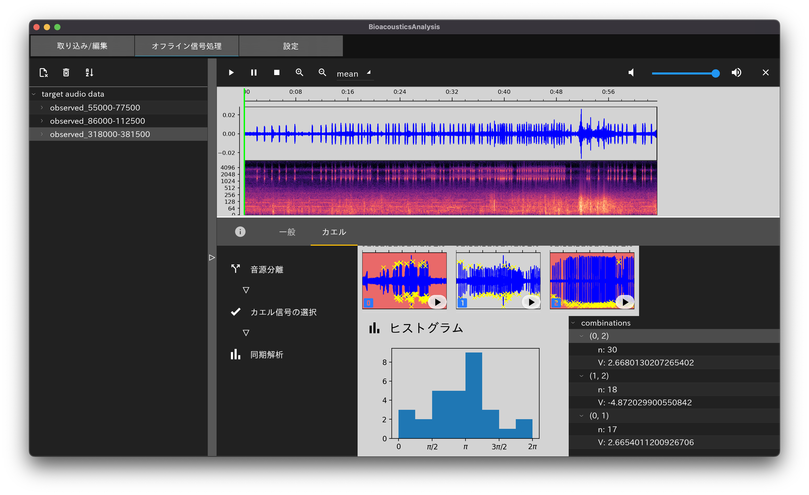

# Bioacoustics Analysis Tools

## 概要
- Python のみでコーディングされた生物音響解析ツール．
    - GUIライブラリ：kivy，kivyMD
    - 行列計算ライブラリ：pytorch，numpy
    - グラフ描画ライブラリ：matplotlib

- 区間抽出，雑音除去などの前処理から，解析処理までの一連の作業をできるだけ簡単に行えるような形で実装することが目標．
    - 前処理：無音区間の除去による区間抽出 ~~，雑音除去~~，~~週端数フィルタ~~
    - 音声信号処理： 音源分離，~~音源定位~~
    - 生物ごとの解析処理： カエルのコーラス解析

- メインで開発を進めるのは，アマガエルのコーラス解析の処理．~~将来的には様々な生物に対応したい．~~

## 実装機能

### 前処理
無音区間の除去を行う．

### アマガエルのコーラス解析
1. 野外のアマガエルの多チャネル観測信号をブラインド音源分離
2. 分離信号からアマガエルの信号を選択
3. 修正版レイリー検定を用いた統計量とヒストグラムをプロット

## ToDo
- データ書き出し機能
    - 前処理信号
    - 分離信号
    - 各種統計量 など
- ステータスバー
    - 処理の進捗状況 など
- 音源定位
- オプションの拡充 など

## アプリケーション実行例
画面は開発中のものです．

